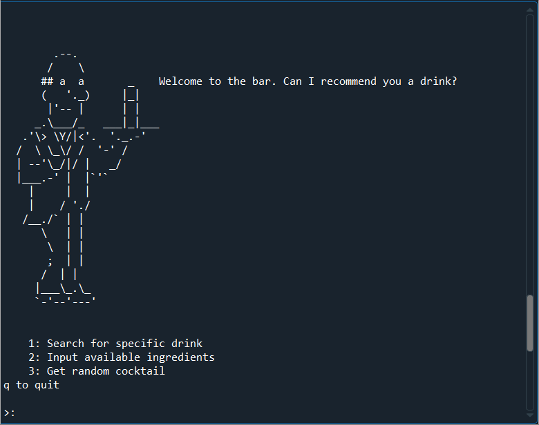

# virtual-bartender
If you tell it what ingredients you have, this program will list all the cocktails you can make

Its a prototype - pass no judgements yet!
It also has some primitive approximate-matching going on, so it doesn't matter if you misspell the names of your ingredients or anything.

Example Demos:
----

| Getting reccomendations | 
|:---:|
| |
|Searching for cocktails |
||
